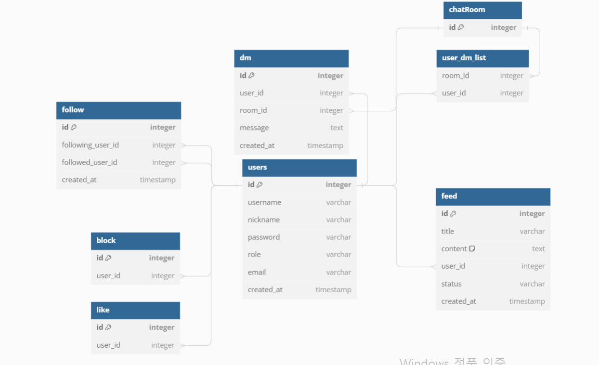

# 인스타그램 클론 프로젝트 hyunstagram

---

## 개요

**[프로젝트 설명](##프로젝트-설명)**

**[사용 기술](##사용-기술)**

**[구조 및 설계](##구조-및-설계)**

**[실행부](##실행부)**

**[회고](##회고)**

---

## 프로젝트 설명
**1. 프로젝트 기간 :2024/01/22~ 2024/02/12**

**2. 프로젝트 기능 :**
    
    개인 프로필 : 회원정보 수정, 팔로우 관리 
    인스타 피드 : 좋아요,팔로우 
    인스타 DM   : 팔로우 챗

---

## 사용 기술

**1. backend**

    언어 : Java
    프레임워크 : spring boot 3.2.1
    라이브러리 : data-jpa / web / websocket / thymeleaf / devtool / lombok / mysql
    빌드 : gradle 8.5
    데이터베이스 : mysql

**2. frontend**
    
    언어: JavaScript
    프레임워크 : node.js 21.6.0
    라이브러리 : react 18.2.0
    
    

## 구조
